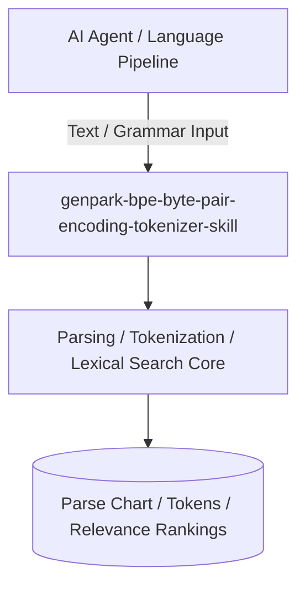

# genpark-bpe-byte-pair-encoding-tokenizer-skill

[](https://github.com/alphaparkinc/genpark-bpe-byte-pair-encoding-tokenizer-skill/actions)
[](https://opensource.org/licenses/MIT)
[](https://www.python.org/downloads/)

> Byte-Pair Encoding (BPE) subword tokenizer implementing corpus pair statistics, iterative vocabulary merges, and greedy token segmentation.

## Architecture



## Features
- Pure standard library Python implementation with strictly zero pip dependencies.
- Fundamental computational linguistics and NLP algorithms (Earley, CKY, BPE, Beam Search, BM25).
- Native Model Context Protocol (MCP) server support for AI agent text intelligence.

## Installation

```bash
git clone https://github.com/alphaparkinc/genpark-bpe-byte-pair-encoding-tokenizer-skill.git
cd genpark-bpe-byte-pair-encoding-tokenizer-skill
```

## Quickstart

```bash
python example_usage.py
```
